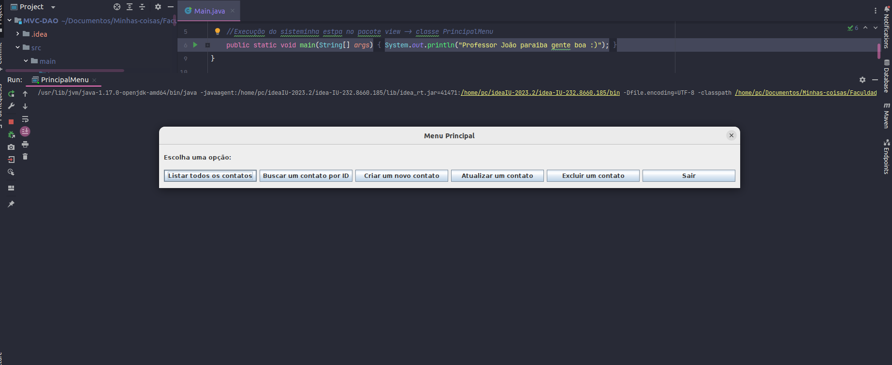
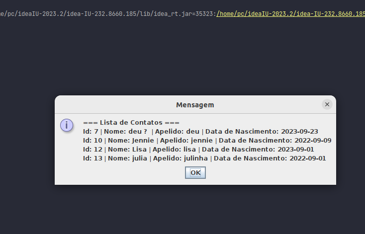
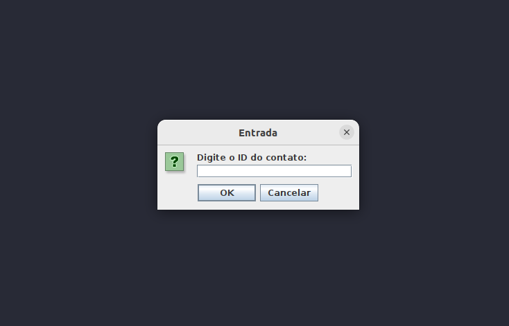
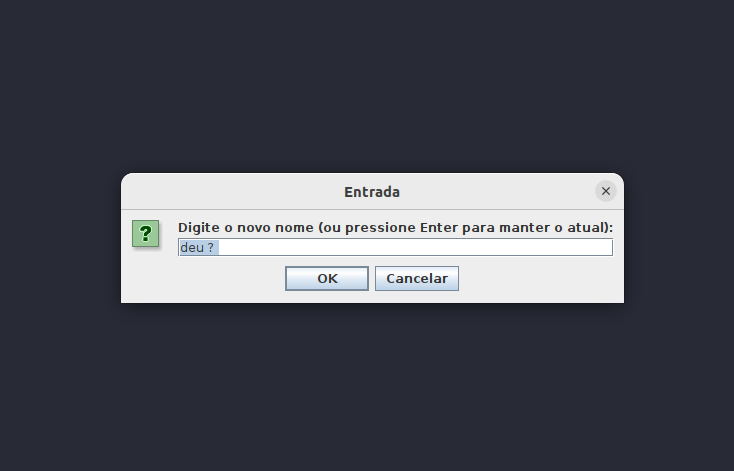
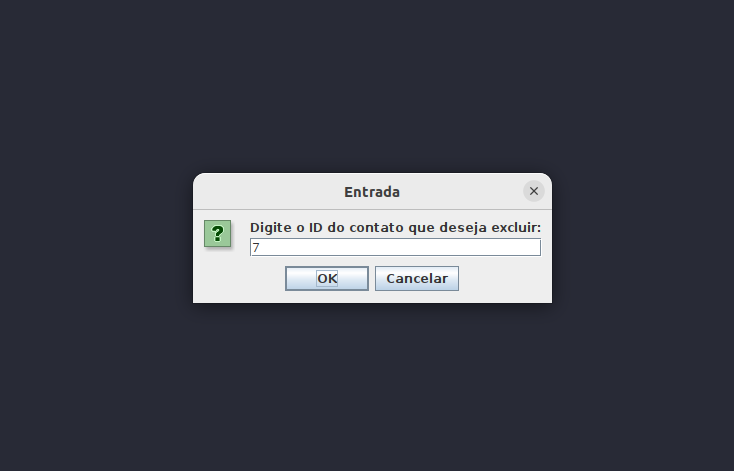
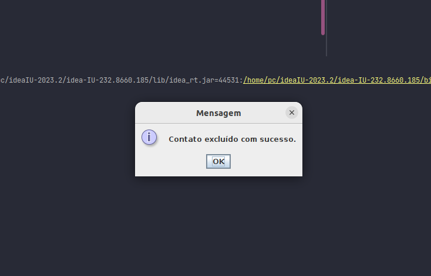

## MVC

Este projeto foi desenvolvido como uma atividade na disciplina de Prática de Engenharia de Software.

O professor propôs a criação de um CRUD de contatos, sem a utilização de frameworks externos, como Spring ou JPA.

Esta experiência se revelou interessante, pois representou um desafio em relação à abertura e fechamento de conexões com o banco de dados. Isso ressaltou a importância e a conveniência do uso de frameworks, como o Spring, que simplificam significativamente tarefas que, de outra forma, podem ser consideradas tediosas.

A conexão com o MySQL foi estabelecida utilizando Docker. Portanto, se você pretende fazer o download e visualizar este projeto em seu ambiente local, será necessário configurar adequadamente as configurações do ambiente. ;)
* Algumas Telinhas

* 
* 
* 
* 
* 

### Entre outras telinhas.
