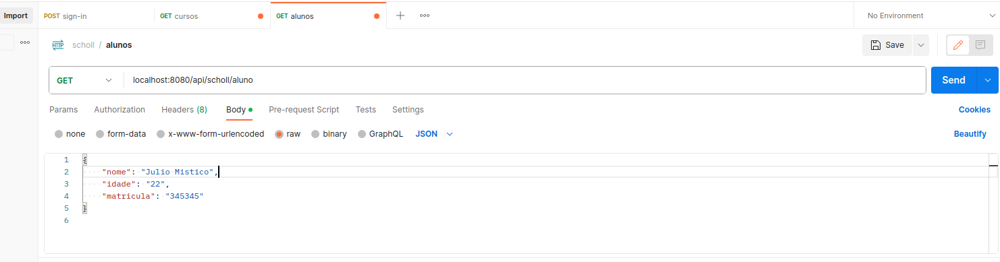
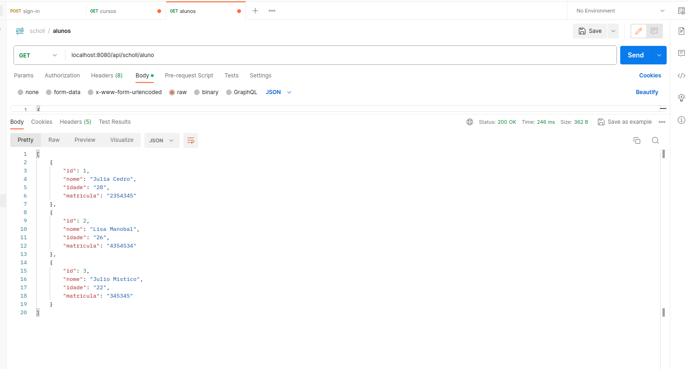
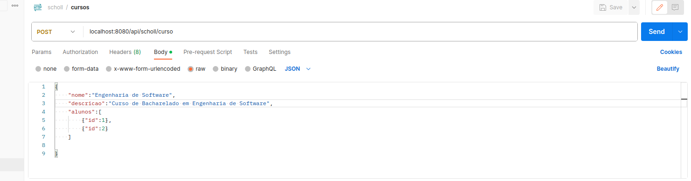
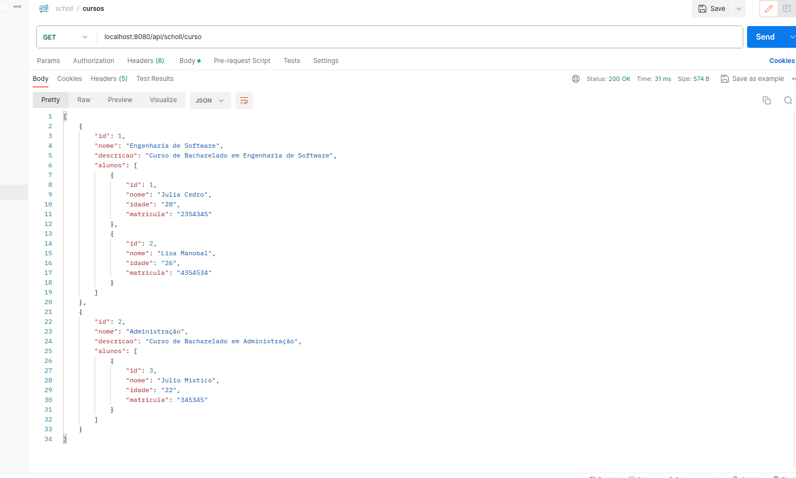

### Response Crud

Atenção: Para garantir o correto funcionamento deste projeto, é imprescindível criar uma instância do MySQL no Docker. As configurações para a instância estão localizadas na pasta "resources" dentro do diretório do aplicativo. Certifique-se de consultar e ajustar as configurações conforme necessário.

#### Alunos
* Criando Recurso

* Listagem

#### Cursos
* Criando Recurso

* Listagem
 

